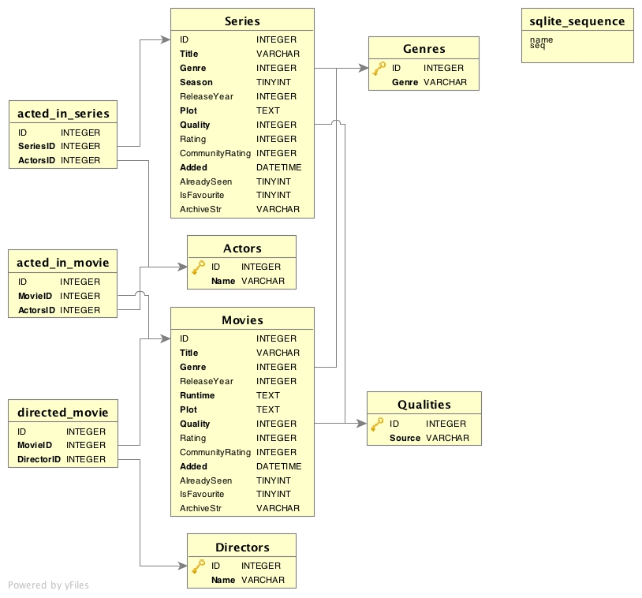

# cMovies
Coming soon :smiley:

##Table of contents

1. [About](#about)
2. [Installation](#installation)
    * [Creating the database](#create_database)
    * [Compiling the code](#compile_code)
3. [Structure](#structure)
    * [Database structure](#database_structure)
    * [Code structure](#code_structure)
4. [TODO-list](#todo)
5. [Changelog](#changelog)
6. [Examples](#examples)

<div id='about' />
## 1. About

*cMovies* is a small (in the works) command-line-utility for managing a [sqlite3](http://www.sqlite.org/about.html) database to
organize your personal movies and series collection.
It stores basic informations like _**title**_, _**plot**_, _**your rating**_, _**entry date**_ &amp; where you stored it 
inside your collection (e.g _**DVD**_, _**HDD filepath**_, _**DVD map "xyz"**_ etc. pp.).  
Furthermore, you are able to store the materials´ quality (e.g. _**DVD**_, _**BluRay**_, _**Telesync**_, _**CAM**_ etc. pp.) alongside with some other information. 


*cMovies* will be running under *Unix*-based operating systems (when using [NCurses](https://www.gnu.org/software/ncurses/)/[CDK](http://invisible-island.net/cdk/manpage/cdk.3.html)).

<div id='installation' />
## 2. Installation

Since this is just a little project, there´s not much to do... 

<div id='create_database' />
### Creating the database

Just run the shell script inside the project directory with 
```shell
./makeDB.sh
``` 
This will create the database *&ldquor;movies.db&rdquor;* inside the *bin* directory.

<div id='compile_code' />
### Compiling the code

Just run 
```shell
make
``` 
inside the project directory to call the *MAKEFILE* with *make*, which will create the binary inside the projects´ *bin* directory. 
Alternatively, you can use the included XCode project file if you´re developing under MacOS.

<div id='structure' />
## 3. Structure

<div id='database_structure' />
### Database structure



*Look into the &ldquor;movies.sql&rdquor; file for further information about the layout* 

<div id='code_structure' />
### Code structure
   
     [PROJECT-DIR]
      ||
       ==> bin/         (database and executable)
            ||
             ==> - cmovies : the application
                 - movies.db : the database
                 - cmovies.log : the log file of the application
      ||
       ==> src/         (the C source code)
            ||
             ==> - cmovies.c : main application code (entry point)
                 - cmovies.h : header file for the main application (structure & function prototypes)
                 - dbutils.c : implementation of database functions (add movie, add series etc. pp.)
                 - dbutils.h : header with sql queries & function prototypes
                 - log.c : implementation of the logging functionality
                 - log.h : header with function prototype for log.c code file
      ||
       ==> tests/       (SQL-tests)
            ||
             ==> valgrind-results/
                    ||
                     ==>   valgrind memcheck results of the test cases 
            ||
             ==> executables/
                    ||
                     ==> - the binaries of the test cases
            ||
             ==> several code files for testing
      ||                
       ==>              (installation files & other)
           - makefile : compiles the source code with the "make" utility  
           - README.md : The markdown file you´re reading right now :smiley:
           - movies_db_layout.jpg : cheat-picture of the database layout
           - makeDB.sh : the shell script which creates the database out of the sql-statements in "movies.sql"
           - movies.sql : SQL DDL statements which define our database layout
             
<div id='todo' />
## 4. TODO-list

- [x] define DDL
- [x] prepare code skeleton
- [x] test the basic underlying sql
- [x] push the early and working version to a version control system like _**Git**_
- [ ] create a TUI with NCurses/CDK
- [ ] switch to GNU-Autotools if the things get more complex (instead of using shell install scripts)
- [ ] patch errors and other stuff
- [ ] adding support for online databases like &ldquor;rottentomatoes&rdquor; etc. (???) 

<div id='changelog' />
## 5. Changelog

What´ New ?!

> 09/08/2016:
>
>   - Implemented the remaining functions for series support
>   - Added 2 new genres
>   - Implemented deletion functions
>   - some minor code changes
>   - What´s next to come ?
>         - implement the UPDATE function
>         - semantics error checks & fixes
>         - some minor additions (rearrange and add some logging, implement the update functions)
>         - TUI
>
>
> 09/03/2016:
>
>   - Initial release
>       

<div id='examples' />
## 6. Examples

*Check out the &ldquor;tests&rdquor; directory*
